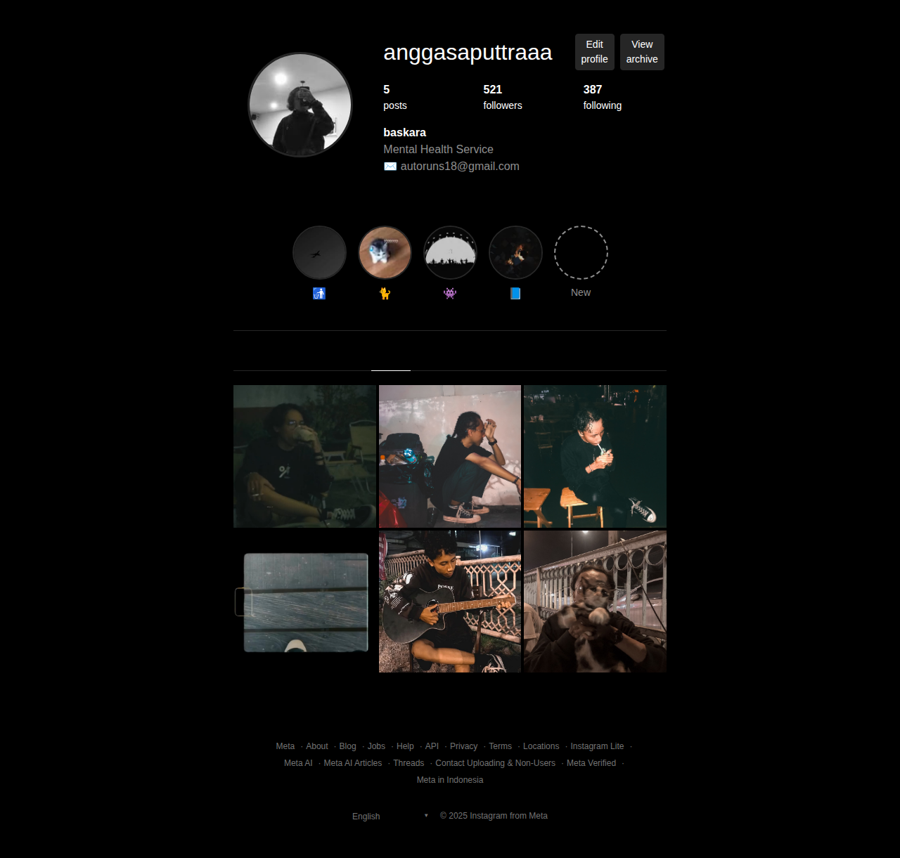

# Tugas HTML CSS - Bootstrap vs Tailwind

Repositori ini berisi implementasi dan perbandingan antara framework CSS **Bootstrap** dan **Tailwind CSS** dalam pembuatan halaman web Instagram profile.

## 📋 Daftar Isi

- [Tentang Project](#tentang-project)
- [Structure Repository](#structure-repository)
- [Bootstrap Implementation](#bootstrap-implementation)
- [Tailwind Implementation](#tailwind-implementation)
- [Perbandingan Framework](#perbandingan-framework)
- [Cara Menjalankan](#cara-menjalankan)
- [Fitur yang Diimplementasikan](#fitur-yang-diimplementasikan)

## 🎯 Tentang Project

Project ini merupakan tugas pembelajaran untuk memahami perbedaan pendekatan dalam styling web menggunakan dua framework CSS populer:

1. **Bootstrap** - Framework CSS dengan komponen siap pakai
2. **Tailwind CSS** - Framework CSS dengan pendekatan utility-first

Kedua framework digunakan untuk membuat halaman Instagram profile yang identik secara visual namun berbeda dalam implementasi kode.

## 📁 Structure Repository

```
tugashtmlcss/
├── pertemuan1/           # Pembelajaran HTML dasar
├── pertemuan2/           # Pembelajaran CSS dasar
├── pertemuan3/           # Implementasi Framework CSS
│   ├── bootstrap/        # Implementasi menggunakan Bootstrap
│   │   ├── img/         # Gambar profil dan konten
│   │   ├── index.html   # Halaman utama Bootstrap
│   │   ├── style.css    # Custom CSS untuk Bootstrap
│   │   ├── package.json # Dependencies Bootstrap
│   │   └── node_modules/# Bootstrap modules
│   └── tailwind/        # Implementasi menggunakan Tailwind
│       ├── img/         # Gambar profil dan konten
│       └── index.html   # Halaman utama Tailwind
├── tugas html css/      # Tugas HTML CSS dasar
└── README.md           # Dokumentasi ini
```

## 🅱️ Bootstrap Implementation

### Tentang Bootstrap

Bootstrap adalah framework CSS yang menyediakan komponen-komponen siap pakai dan sistem grid yang responsif. Bootstrap menggunakan pendekatan **component-based** dimana developer menggunakan class yang sudah didefinisikan untuk styling.

### Setup Bootstrap

```html
<!-- Bootstrap CSS -->
<link href="./node_modules/bootstrap/dist/css/bootstrap.min.css" rel="stylesheet" />

<!-- Bootstrap JavaScript -->
<script src="./node_modules/bootstrap/dist/js/bootstrap.bundle.min.js"></script>
```

### Contoh Kode Bootstrap

```html
<!-- Profile Header dengan Bootstrap -->
<div class="row align-items-center py-5">
  <div class="col-12 col-md-4 text-center mb-4 mb-md-0">
    
  </div>
  <div class="col-12 col-md-8">
    <div class="d-flex flex-column flex-sm-row align-items-start align-items-sm-center mb-3 gap-3">
      <h2 class="mb-0 me-3">anggasaputtraaa</h2>
      <div class="d-flex gap-2">
        <button class="btn btn-outline-light btn-sm">Edit profile</button>
        <button class="btn btn-outline-light btn-sm">View archive</button>
      </div>
    </div>
  </div>
</div>
```

### Keunggulan Bootstrap

- ✅ **Komponen siap pakai** - Button, card, navbar, dll sudah tersedia
- ✅ **Grid system** yang powerful dan mudah dipahami
- ✅ **Responsive design** bawaan
- ✅ **Browser compatibility** yang baik
- ✅ **Learning curve** yang lebih mudah untuk pemula
- ✅ **Dokumentasi** yang lengkap dan jelas

### Kekurangan Bootstrap

- ❌ **File size** yang lebih besar
- ❌ **Customization** terbatas tanpa mengubah source
- ❌ **Design uniformity** - website terlihat "Bootstrap-like"
- ❌ **Overhead** untuk project sederhana

## 🎨 Tailwind Implementation

### Tentang Tailwind CSS

Tailwind CSS adalah framework CSS dengan pendekatan **utility-first** yang menyediakan class-class kecil untuk setiap properti CSS. Developer membangun design dengan menggabungkan utility classes.

### Setup Tailwind

```html
<!-- Tailwind CDN -->
<script src="https://cdn.tailwindcss.com"></script>
```

### Contoh Kode Tailwind

```html
<!-- Profile Header dengan Tailwind -->
<div class="flex items-start mb-16">
  <div class="flex-shrink-0 mr-20">
    <div class="relative">
      <div class="w-44 h-44 rounded-full p-1">
        
      </div>
    </div>
  </div>
  <div class="flex-1">
    <div class="flex items-center mb-8">
      <h1 class="text-3xl font-light mr-8">anggasaputtraaa</h1>
      <div class="flex space-x-3">
        <button class="bg-gray-900 hover:bg-gray-600 px-5 py-2 rounded-md text-sm font-medium mr-3">
          Edit profile
        </button>
        <button class="bg-gray-900 hover:bg-gray-600 px-5 py-2 rounded-md text-sm font-medium mr-3">
          View archive
        </button>
      </div>
    </div>
  </div>
</div>
```

### Keunggulan Tailwind

- ✅ **Highly customizable** - kontrol penuh atas design
- ✅ **Smaller file size** dalam production (dengan purging)
- ✅ **Consistent spacing** dan sizing system
- ✅ **No naming conflicts** - tidak perlu memikirkan nama class
- ✅ **Rapid prototyping** - build UI dengan cepat
- ✅ **Responsive design** yang fleksibel

### Kekurangan Tailwind

- ❌ **Learning curve** yang lebih steep
- ❌ **HTML markup** yang bisa terlihat verbose
- ❌ **Tidak ada komponen** siap pakai
- ❌ **Setup awal** yang lebih kompleks untuk production

## 🔍 Analisis Kode Detail

### Contoh Implementasi Grid Layout

**Bootstrap Approach:**
```html
<!-- Menggunakan Bootstrap Grid System -->
<div class="container-fluid">
  <div class="row justify-content-center">
    <div class="col-12 col-lg-8 col-xl-6">
      <div class="row align-items-center py-5">
        <div class="col-12 col-md-4 text-center mb-4 mb-md-0">
          <!-- Profile Picture -->
        </div>
        <div class="col-12 col-md-8">
          <!-- Profile Info -->
        </div>
      </div>
    </div>
  </div>
</div>
```

**Tailwind Approach:**
```html
<!-- Menggunakan Flexbox utilities -->
<div class="max-w-6xl mx-auto px-6 py-10">
  <div class="flex items-start mb-16">
    <div class="flex-shrink-0 mr-20">
      <!-- Profile Picture -->
    </div>
    <div class="flex-1">
      <!-- Profile Info -->
    </div>
  </div>
</div>
```

### Handling Responsive Design

**Bootstrap:**
- Menggunakan breakpoint classes: `col-12`, `col-md-4`, `col-lg-8`
- Responsive utilities: `d-flex`, `d-none`, `d-md-block`
- Pre-defined breakpoints: xs, sm, md, lg, xl, xxl

**Tailwind:**
- Prefix responsive: `sm:`, `md:`, `lg:`, `xl:`, `2xl:`
- Contoh: `flex flex-col md:flex-row lg:space-x-8`
- Mobile-first approach dengan utility stacking

### Custom Theming

**Bootstrap dengan CSS Variables:**
```css
:root {
  --ig-bg: #000000;
  --ig-border: #262626;
  --ig-text-secondary: #8e8e8e;
  --ig-button: #0095f6;
}

.profile-img {
  width: 150px;
  height: 150px;
  border: 3px solid var(--ig-border);
}
```

**Tailwind dengan Custom Classes:**
```css
.story-gradient {
  background: linear-gradient(
    45deg,
    #f09433 0%,
    #e6683c 25%,
    #dc2743 50%,
    #cc2366 75%,
    #bc1888 100%
  );
}
```

## ⚖️ Perbandingan Framework

| Aspek | Bootstrap | Tailwind CSS |
|-------|-----------|--------------|
| **Pendekatan** | Component-based | Utility-first |
| **File Size** | ~200KB (minified) | ~10KB (purged) |
| **Learning Curve** | Mudah untuk pemula | Butuh waktu lebih lama |
| **Customization** | Terbatas tanpa custom build | Sangat fleksibel |
| **Development Speed** | Cepat dengan komponen | Cepat setelah terbiasa |
| **Design Uniqueness** | Terlihat "Bootstrap-like" | Lebih unik dan custom |
| **Browser Support** | Excellent | Excellent |
| **Community** | Sangat besar | Berkembang pesat |
| **Setup Complexity** | Medium (npm install) | Easy (CDN) / Complex (build tools) |
| **HTML Readability** | Lebih bersih | Bisa verbose dengan banyak class |
| **CSS Override** | Perlu specificity tinggi | Jarang perlu override |

## 📊 Performance Analysis

### File Size Comparison
- **Bootstrap**: 
  - CSS: ~200KB (uncompressed), ~25KB (gzipped)
  - JS: ~80KB (bundle), ~20KB (gzipped)
- **Tailwind**: 
  - Development: ~3MB+ (all utilities)
  - Production: ~10KB (setelah purging unused classes)

### Build Time
- **Bootstrap**: Instant (pre-compiled)
- **Tailwind**: Butuh build process untuk production optimization

### Runtime Performance
Kedua framework memiliki performa runtime yang sama karena menghasilkan CSS standar. Perbedaan utama ada pada:
- **Initial load time**: Tailwind production lebih cepat
- **Cache efficiency**: Bootstrap lebih baik karena file statis

## 📸 Preview Hasil

### Bootstrap Implementation


### Tailwind Implementation


## 🚀 Cara Menjalankan

### Bootstrap Version

1. Masuk ke folder bootstrap:
   ```bash
   cd pertemuan3/bootstrap
   ```

2. Install dependencies:
   ```bash
   npm install
   ```

3. Buka `index.html` di browser atau gunakan live server

### Tailwind Version

1. Masuk ke folder tailwind:
   ```bash
   cd pertemuan3/tailwind
   ```

2. Buka `index.html` di browser atau gunakan live server
   (Tailwind menggunakan CDN sehingga tidak perlu install dependencies)

## ✨ Fitur yang Diimplementasikan

Kedua implementasi mencakup:

- 📸 **Profile Header** dengan foto profil dan informasi user
- 📊 **Statistics Section** dengan jumlah posts, followers, following
- 📝 **Bio Section** dengan deskripsi profil
- 🎯 **Story Highlights** dengan gradient border effect
- 🖼️ **Posts Grid** dengan layout responsive
- 📱 **Responsive Design** untuk mobile dan desktop
- 🔗 **Footer Links** dengan styling Instagram-like

### Custom Styling

**Bootstrap**: Menggunakan `style.css` untuk customization
```css
:root {
  --ig-bg: #000000;
  --ig-border: #262626;
  --ig-text-secondary: #8e8e8e;
}

.profile-img {
  width: 150px;
  height: 150px;
  border: 3px solid var(--ig-border);
}
```

**Tailwind**: Menggunakan inline custom styles
```css
.story-gradient {
  background: linear-gradient(45deg, #f09433 0%, #e6683c 25%, #dc2743 50%, #cc2366 75%, #bc1888 100%);
}
```

## 📱 Responsive Design

Kedua implementasi menggunakan pendekatan mobile-first dan fully responsive:

- **Mobile** (< 768px): Layout stack vertical, ukuran elemen disesuaikan
- **Tablet** (768px - 1024px): Layout hybrid, beberapa elemen side-by-side
- **Desktop** (> 1024px): Layout horizontal penuh sesuai design Instagram

## 🎯 Kesimpulan

### Kapan Menggunakan Bootstrap?

✅ **Pilih Bootstrap jika:**
- Team dengan skill CSS terbatas
- Project dengan deadline ketat
- Butuh komponen UI yang konsisten
- Prototyping rapid untuk demo/testing
- Working dengan designer yang familiar dengan Bootstrap
- Project enterprise dengan maintenance jangka panjang

### Kapan Menggunakan Tailwind?

✅ **Pilih Tailwind jika:**
- Design custom dan unique diperlukan
- Team developer berpengalaman
- Project dengan requirement design yang detail
- Butuh kontrol penuh atas styling
- Performance adalah prioritas utama
- Sudah familiar dengan utility-first approach

### Best Practices

**Bootstrap Best Practices:**
```html
<!-- ✅ Good: Gunakan semantic class names -->
<div class="card profile-card">
  <div class="card-body">
    <h5 class="card-title">Username</h5>
  </div>
</div>

<!-- ❌ Avoid: Override Bootstrap classes secara berlebihan -->
<div class="btn btn-primary" style="background: red !important;">
```

**Tailwind Best Practices:**
```html
<!-- ✅ Good: Group related utilities -->
<div class="flex items-center justify-between 
            bg-white shadow-lg rounded-lg 
            p-6 space-x-4">

<!-- ✅ Good: Extract ke component untuk reusability -->
<div class="btn-primary"><!-- defined in CSS --></div>

<!-- ❌ Avoid: Terlalu banyak utilities dalam satu element -->
<div class="flex items-center justify-between bg-white shadow-lg rounded-lg p-6 space-x-4 hover:shadow-xl transition-shadow duration-300 transform hover:scale-105">
```

### Kesimpulan Akhir

Kedua framework memiliki kelebihan dan kekurangan masing-masing. Yang terpenting adalah:

1. **Konsistensi** dalam penggunaan framework yang dipilih
2. **Team skill** dan familiarity dengan approach yang digunakan  
3. **Project requirements** dan constraints yang ada
4. **Long-term maintenance** dan scalability considerations

Dalam project pembelajaran ini, kedua implementasi menghasilkan UI yang sangat mirip, membuktikan bahwa hasil akhir lebih bergantung pada skill developer daripada framework yang dipilih.

---

**Dibuat untuk pembelajaran CSS Framework di Pertemuan 3**  
**Repository**: [nikamushi/tugashtmlcss](https://github.com/nikamushi/tugashtmlcss)